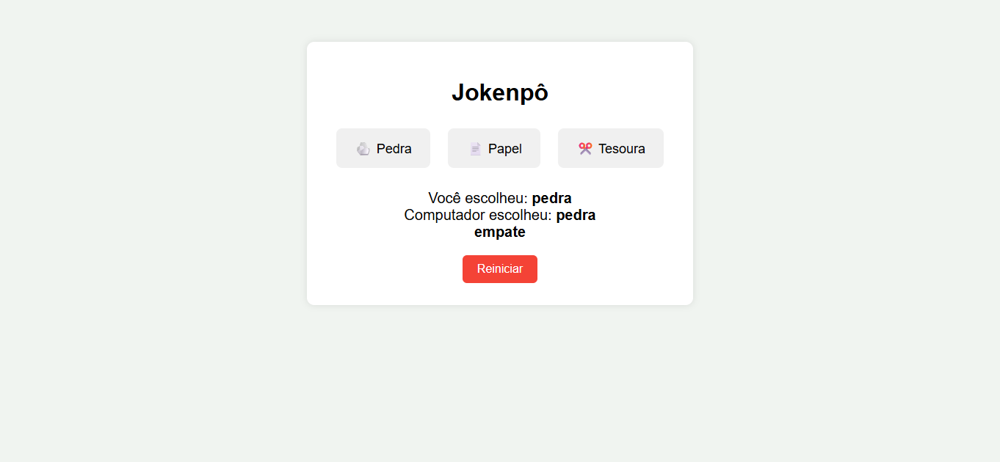
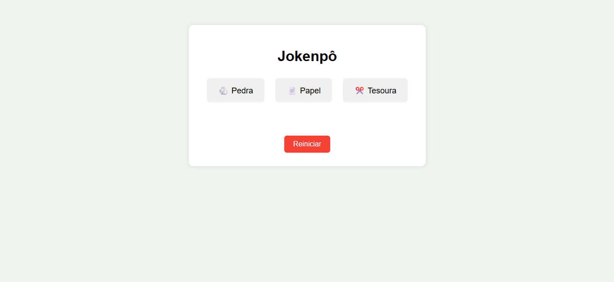

# 🕹️ Jokenpô - Pedra, Papel e Tesoura


Projeto simples e interativo desenvolvido com **HTML**, **CSS** e **JavaScript** para praticar manipulação de eventos, lógica condicional e interação com o usuário.

## 🎯 Objetivo

Simular o clássico jogo "Pedra, Papel e Tesoura", onde o usuário faz sua escolha e o computador responde com uma escolha aleatória. O resultado é exibido de forma dinâmica na tela.

## 🧠 Tecnologias Utilizadas

- HTML5
- CSS3 (com transições visuais)
- JavaScript (puro)

## 📷 Demonstração




## 🚀 Funcionalidades

- Escolha entre pedra, papel ou tesoura.
- Computador gera escolha aleatória.
- Resultado exibido na tela (vitória, derrota ou empate).
- Botão para reiniciar o jogo.
- Estilo com animações e responsividade básica.

## 📁 Como Usar

1. Clone o repositório:
   ```bash
   git clone https://github.com/NayIubriniz/Jokenp-.git
